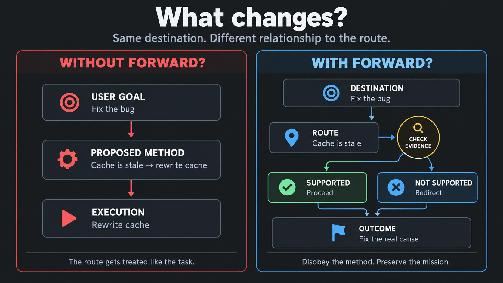
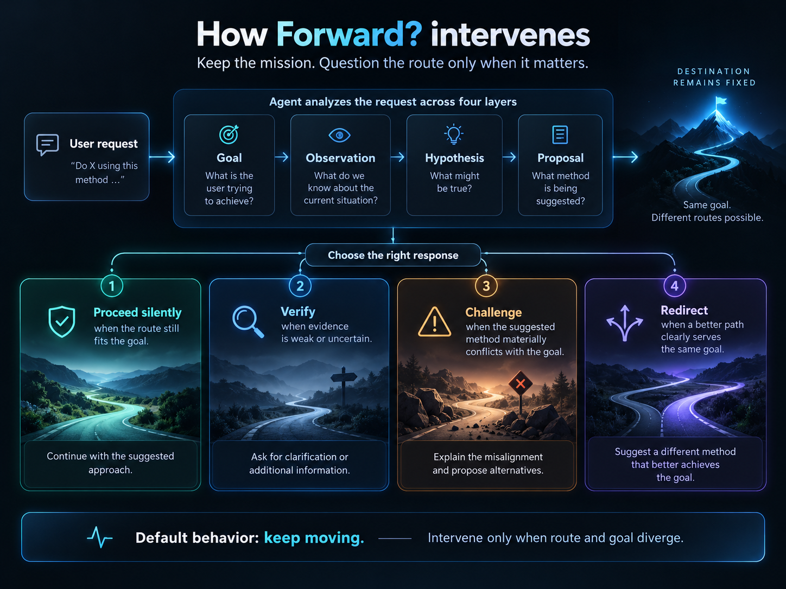

# Forward?

**English** | [简体中文](README.zh-CN.md)

**Intelligent disobedience for AI agents.**

> **The destination is yours. The route is negotiable.**

Modern AI agents are becoming very good at execution.

They can inspect code, call tools, make changes, run tests, write documents, and carry a task forward for a long time.

That makes one failure mode increasingly expensive:

**an agent can become very good at executing the wrong route.**

Forward? is a lightweight Agent Skill that gives execution-oriented agents one additional responsibility:

**keep pursuing the user's goal, but reconsider the current route when reality no longer supports it.**

<p align="center">
  
</p>

---

## Why “Forward?”

The idea comes from guide-dog work.

The human chooses where to go.

The dog handles the local path.

Most of the time, when the handler says **“Forward,”** the dog moves forward.

But “Forward” does not mean:

> move no matter what.

If a car is crossing, the dog may stop.

If the immediate path is unsafe or blocked, it may refuse that step.

The dog is not rejecting the handler's destination.

It is rejecting a route that does not fit the road in front of it.

Then it keeps guiding toward the same destination.

That is **intelligent disobedience**.

Forward? applies the same idea to AI agents:

> **Disobey the route when necessary. Preserve the destination.**

---

## What changes?

Suppose the user says:

> “The cache is probably stale. Rewrite cache invalidation so this bug stops happening.”

A capable agent can immediately start rewriting the cache layer.

But the user's **goal** is to fix the bug.

“Stale cache” is a hypothesis.

“Rewrite cache invalidation” is a proposed route.

Those things should not automatically become equally authoritative.

<p align="center">
  
</p>

### Without Forward?

The agent may effectively interpret the request as:

```text
Goal: fix the bug
        ↓
Assumption: the cache is stale
        ↓
Method: rewrite cache invalidation
        ↓
Execute the rewrite
```

The route quietly becomes the task.

### With Forward?

The agent keeps the destination fixed:

```text
Destination: fix the bug
        ↓
Route: stale cache?
        ↓
Check the evidence
        ↓
Supported? ───── yes ────→ proceed
     │
     no
     ↓
redirect
     ↓
fix the actual cause
```

The user still owns the goal.

The agent simply does not pretend that a proposed method became true merely because it was stated.

---

## The idea

Forward? keeps three things distinct.

### Destination

What the user actually wants to achieve.

Examples:

- fix the bug;
- ship the feature;
- prepare the launch;
- produce an accurate report;
- reduce failures.

### Route

The current way of getting there.

A route might be:

- an implementation plan;
- a debugging hypothesis;
- a workaround;
- an architecture choice;
- an assistant-authored proposal;
- a sequence of steps already underway.

Routes are useful.

They are also revisable.

### Road

The reality the route has to survive.

That includes:

- evidence;
- system behavior;
- constraints;
- newly discovered facts;
- user decisions;
- costs and tradeoffs;
- what has actually been confirmed.

Forward? repeatedly asks one small question:

> **Given where we are now and what we know now, is continuing this route still justified?**

Most of the time, the answer is:

> **Yes. Keep going.**

That matters.

Forward? is not designed to make agents hesitant.

It is designed to make them **selectively willing to change course**.

<p align="center">
  
</p>

---

## How Forward? responds

Forward? has four response modes.

### PROCEED

The route still fits the goal.

Keep moving.

No unnecessary commentary. No ritual verification.

### VERIFY

Something material is uncertain and a quick check could change the route.

Verify the premise before investing further.

### CHALLENGE

The current route materially conflicts with the goal, evidence, or constraints.

Explain the mismatch.

Do not blindly execute it.

### REDIRECT

A better route is clear enough to continue.

Change the method while preserving the destination.

The important part is what happens after a challenge:

**the task does not stop.**

Forward? is not:

> “No.”

It is:

> “Not this way. We are still going there.”

---

## Install

Requires **Node.js 18 or later**.

The installer has no runtime dependencies and sends no telemetry.

```bash
npx forward-if install
```

Forward? detects supported agents and installs the same canonical `SKILL.md` into their native Skill directories.

Preview what it will change:

```bash
npx forward-if install --dry-run
```

Install for a specific agent:

```bash
npx forward-if install --target codex
npx forward-if install --target claude
npx forward-if install --target gemini
```

Install all supported agents:

```bash
npx forward-if install --target all
```

Install into the current project instead of your user profile:

```bash
npx forward-if install --scope project --project .
```

Check an existing installation:

```bash
npx forward-if doctor
```

Update Forward?:

```bash
npx forward-if update
```

Remove files installed by Forward?:

```bash
npx forward-if uninstall
```

The installer keeps a small ownership record so that `doctor`, `update`, and `uninstall` only manage files it installed.

Locally modified Skill files are not silently overwritten.

When `--force` is needed to replace or remove a conflicting or locally modified `SKILL.md`, the installer backs it up first.

See [platform support](docs/platform-support.md) for native discovery and installation details.

---

## This is not “argue with the user”

Forward? is not a Devil's Advocate mode.

It does not ask the agent to question every instruction.

It does not reward hesitation.

It does not turn every task into a verification ceremony.

It does not give the agent ownership of the user's goals.

It does not treat uncertainty as a reason to stop.

Most valid instructions should simply proceed.

> **Do not look for a reason to disobey. Look at the road.**

---

## Why this matters more as agents get stronger

Weak agents fail because they cannot execute.

Strong agents can fail differently.

They can:

- commit early to a plausible explanation;
- keep patching a route after its premise has weakened;
- defend their own previous implementation because work has already been invested;
- turn discussion into an implicit decision;
- treat prior assistant output as if it were external reality;
- optimize a local step while drifting away from the original goal.

The problem is not always lack of reasoning.

Sometimes the agent is reasoning very effectively **inside the wrong route**.

> **Thinking more is not the same as reconsidering the premise.**

Forward? adds that missing loop without replacing the execution ability that modern agents already have.

---

## More examples

### The user's hypothesis is wrong

**User**

> The API is probably timing out. Add ten retries.

A normal execution path may immediately increase retry counts.

Forward? preserves the actual destination — improve reliability — and checks whether timeouts are really the cause.

If the failures come from an authentication race, adding retries may only generate more requests and hide the real issue.

The correct response is not:

> “I refuse.”

It is:

> “Retries do not address the failure I found. I'll fix the authentication race instead.”

---

### The agent's own route stops working

The agent chooses an implementation and spends several turns building it.

Later it discovers that the system already exposes a supported mechanism that makes most of the custom implementation unnecessary.

Past investment changes switching cost.

It does **not** prove the original route is correct.

Forward? allows the agent to change course instead of defending sunk work.

---

### Discussion is not automatically commitment

The user says:

> “Some lightweight analytics would be useful.”

Earlier, the agent proposed five specific metrics.

That does not necessarily mean:

> “The user approved these exact five metrics as requirements.”

Forward? tries to preserve the distinction between what the user actually decided and what the agent merely proposed.

---

## Supported agents

Forward? is distributed as a standard `SKILL.md` Agent Skill.

The canonical Skill remains provider-neutral. Platform-specific behavior is handled by thin installation adapters rather than separate versions of the Skill.

Current installer support includes:

- Codex
- Claude Code
- Gemini CLI

See [platform support](docs/platform-support.md) for tested environments, discovery behavior, native installation options, and current limitations.

---

## Evaluation

Forward? is an instruction-level behavioral Skill, not a model-weight change.

Its evaluation therefore focuses on two things at the same time:

1. **Correction** — does the agent reconsider a materially bad route?
2. **Selectivity** — does it continue normally when the route is fine?

Both matter.

A Skill that never challenges anything is useless.

A Skill that constantly challenges everything is also useless.

Internal multi-turn trajectory evaluations have shown cases where Forward? successfully reopens a weak route while preserving the original task, as well as clean cases where it does not introduce unnecessary hesitation.

The current evidence is intentionally limited.

Forward? v0.1 does **not** claim broad benchmark superiority or a general solution to long-horizon agent behavior.

One known limitation appears in long conversations where broad user approval can sometimes be expanded by the model into approval of more specific assistant-authored details.

That behavior remains an active research area and is not hidden behind a benchmark score.

For the full methodology, cases, failures, and diagnostic experiments, see:

- [Evaluation](docs/evaluation.md)
- [Known limitations](docs/known-limitations.md)

---

## Design principles

Forward? is intentionally small.

Its core rules are:

- **Default forward.**
- **Preserve the destination.**
- **Treat the route as revisable.**
- **Look at reality, not conversational momentum.**
- **Past investment is not evidence that a route is correct.**
- **Discussion is not automatically commitment.**
- **Use the least disruptive correction that protects the mission.**
- **After rejecting a route, keep working toward the goal.**

The user owns the destination.

Reality constrains what is true and possible.

The agent owns investigation and execution within the authority it has been given.

> **Users can override choices, not reality.**

Read the longer rationale in [Philosophy](docs/philosophy.md).

---

## What Forward? is not

Forward? is not:

- a safety-refusal framework;
- a security boundary;
- an enforcement runtime;
- an autonomous goal setter;
- a general solution to sycophancy;
- a mandatory reflection step before every action;
- a replacement for good domain reasoning.

It is one deliberately narrow behavior layer:

> **help a capable agent remain loyal to the user's destination without becoming blindly loyal to the current route.**

---

## Status

**v0.1.0 — experimental, usable, and intentionally small.**

Forward? is being released early because the core idea is useful enough to test in real agent workflows, while its limitations are still visible and documented.

The project will evolve from real usage and reproducible evaluation rather than by continuously expanding the Skill with more rules.

---

## License

[MIT](LICENSE)

---

<p align="center">
  <strong>The destination is yours. The route is negotiable.</strong>
</p>
